# TallerDocumetacionComoCodigo
Taller de documentación como codigo
## Diagramas 
### Diagrama de casos de uso
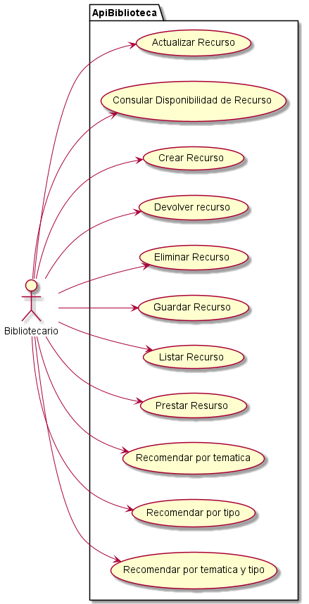
### Diagrama de secuencia
1. Diagrama de secuencia de actualizar recurso
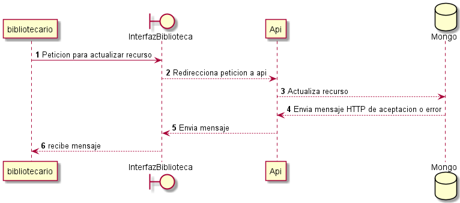
2. Diagrama de secuencia de consultar resurso
   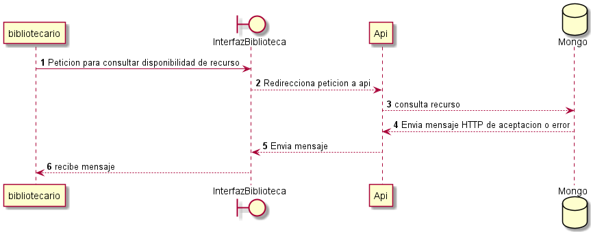
3. Diagrama de secuencia de crear recurso
   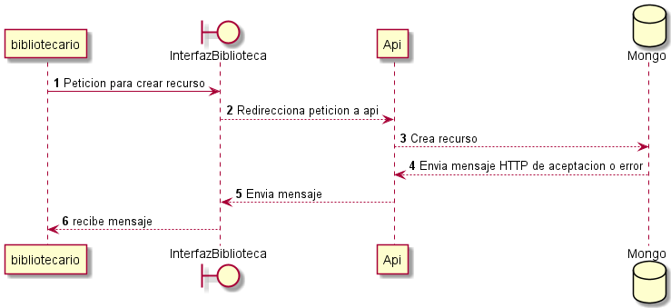
4. diagrama de secuencia de devolver recurso
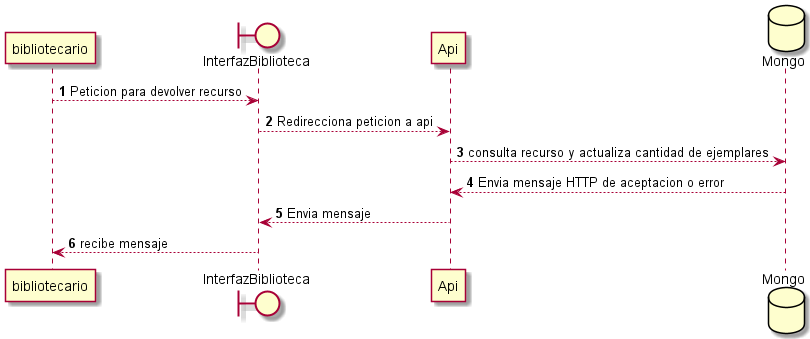
5. diagrama de secuencia de eliminar recurso
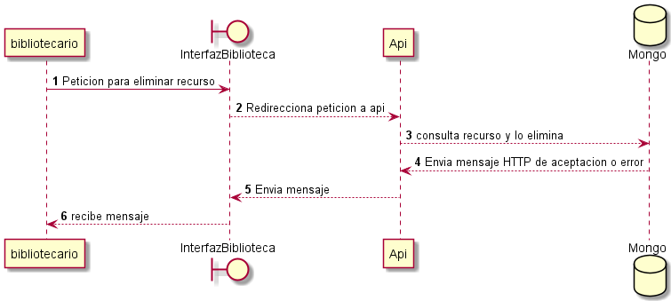
6. diagrama de secuencia de listar recurso
   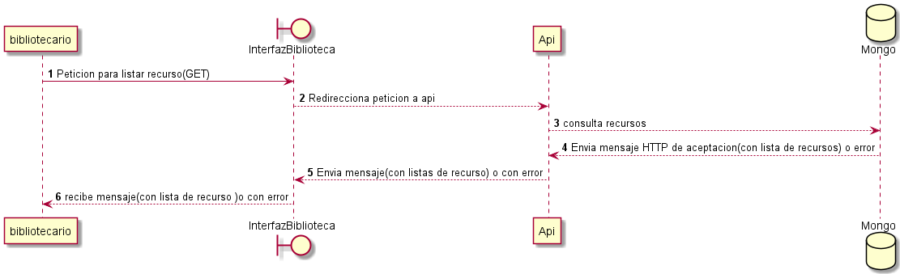
7. diagrama de secuencia de prestar recurso
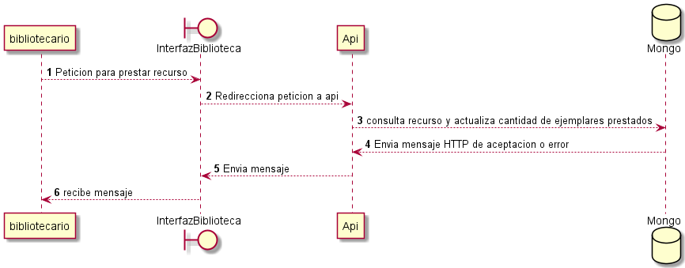
8. diagrama de secuenia de recomendar recurso por tematica
   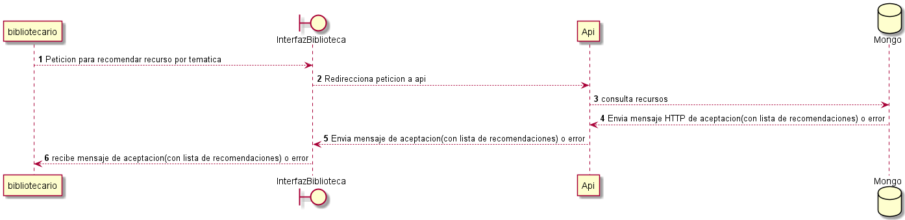
9. diagrama de secuencia de recomentar recurso por tipo de recurso
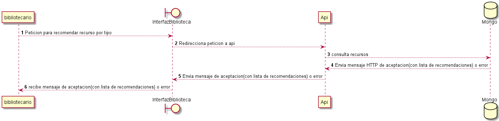
10. diagrama de secuencia de recomendar recurso por tipo y tematica
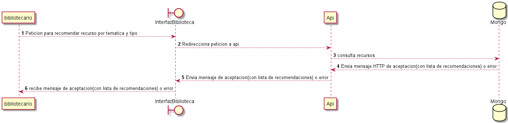